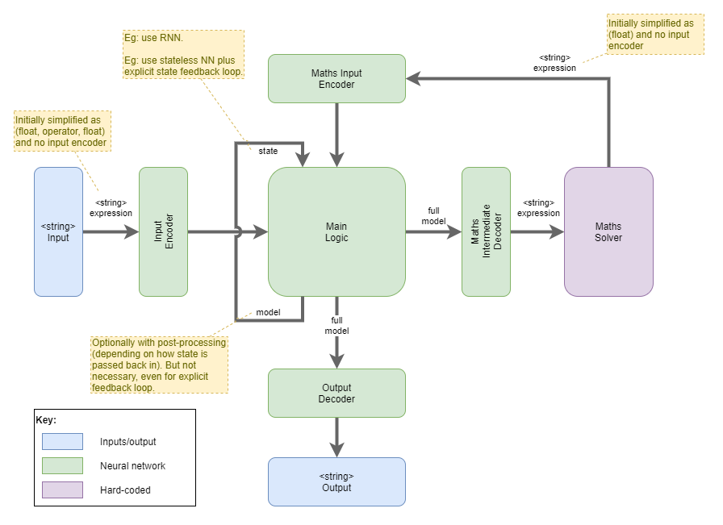
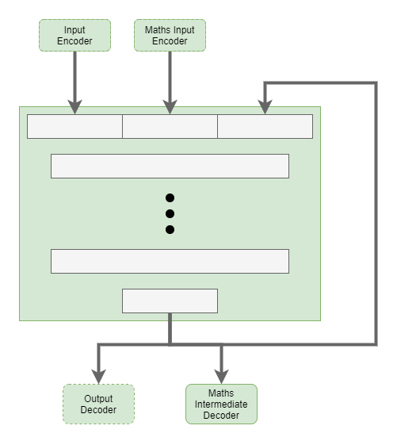

# Number Adder 2
Goal is to create an AI that can use a pre-configured maths solver to answer simple arithmetic questions, trained using Reinforcement Learning.

## Architecture

## Next Steps

### Internalised Reward Function
Progression of reward functions:
1. External reward function
    * Typically static. Could be learned, but its result is unknown to the AI.
    * Used during initial training. Can be used in online training.
2. Internalised static reward function
    * AI architected and trained to learn the reward function.
    * Trained during initial training.
    * Becomes static once using AI in online state.
3. Internalised simple learned reward function
    * Internalised reward function that can continue to be trained during online state.
    * Used as a value estimator that gives immediate reward to each action during online activity.
    * Subsequently re-trained from occasional external feedback.
    * Behaves in a way that is similar to dopamine in humans. Dopamine is an internalised simplified model built up over time from external feedback. Occasionally it gives us happy feelings for actions that were actually bad, and external feedback is required to counteract it (ie: punish).
    * Questions remain whether this needs some sort of low-level enforced control to prevent instability from catastrophic memory less of the reward function.
4. Hierchically learned reward function
    * Continually trainable internalised reward function that builds up hierarchically, with higher and higher order domain knowledge.
    * Totally capable of suppressing low-order value functions that may have been internalised during initial training.

### Self-monitoring of Output
The AI needs to know when it produces output so that:
* its main logic can rationalise about when it does/does not produce output,
* its main logic can rationalise about what it produces as output, and
* its internalised reward system can judge on those actions.

That feedback is perhaps not necessary while using an external reward function, and the external reward function can measure the output without the main logic knowing anything about it.

However, an internalised reward function will need the feedback. The long term goal of the internalised reward function is that it will be learned and improved on over time. In particular, it will incorporate hierarchical learning, where specific domain knowledge is used to judge the value of the action. One question remains therefore: will output feedback be necessary for a more simplistic non-hierarchically-learned internalised reward function?